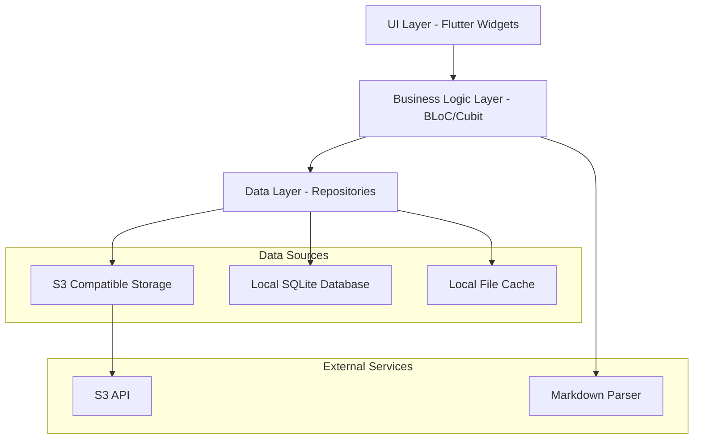
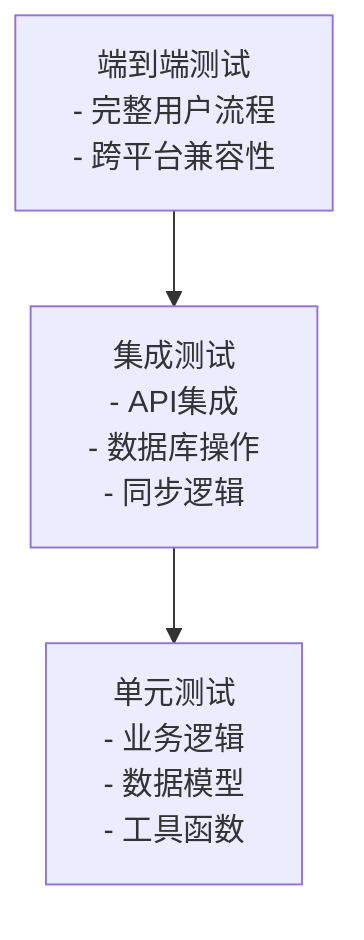

# 设计文档

## 概述

S3 Flutter笔记应用是一个跨平台的Markdown笔记管理应用，支持Android、Windows和Mac桌面端。应用采用三栏布局设计，集成S3兼容对象存储，提供实时编辑预览、多级目录管理和标签过滤功能。

## 架构

### 整体架构



### 分层架构说明

1. **UI层**: Flutter widgets，负责界面展示和用户交互
2. **业务逻辑层**: 使用BLoC模式管理状态和业务逻辑
3. **数据层**: Repository模式，统一管理本地和远程数据源
4. **数据源**: S3存储、本地SQLite数据库、本地文件缓存

## 组件和接口

### 核心组件

#### 1. 存储管理组件

```dart
// S3文件存储服务接口 - 主要数据源
abstract class S3FileStorageService {
  // 文件操作
  Future<void> uploadFile(String path, String content);
  Future<String> downloadFile(String path);
  Future<void> deleteFile(String path);
  Future<bool> fileExists(String path);
  
  // 目录操作
  Future<List<String>> listFiles(String prefix);
  Future<List<String>> listFolders(String prefix);
  Future<void> createFolder(String path);
  Future<void> deleteFolder(String path);
  
  // 批量操作
  Future<void> uploadMultipleFiles(Map<String, String> files);
  Future<Map<String, String>> downloadMultipleFiles(List<String> paths);
  
  // 同步操作
  Future<void> syncToRemote();
  Future<void> syncFromRemote();
  Future<bool> checkConnection();
}

// 本地缓存服务接口 - 可选的中间层
abstract class LocalCacheService {
  // 缓存管理
  Future<void> cacheFile(String path, String content);
  Future<String?> getCachedFile(String path);
  Future<void> clearCache();
  Future<List<String>> getCachedFiles();
  
  // 离线支持
  Future<void> markForSync(String path);
  Future<List<String>> getPendingSyncFiles();
  Future<void> clearSyncQueue();
}

// 导入导出服务接口
abstract class ImportExportService {
  // 导出功能
  Future<void> exportToLocal(String localPath);
  Future<void> exportToZip(String zipPath);
  
  // 导入功能
  Future<void> importFromLocal(String localPath);
  Future<void> importFromZip(String zipPath);
  
  // 验证功能
  Future<bool> validateImportStructure(String path);
}
```

#### 2. 笔记管理组件

```dart
// 笔记数据模型
class Note {
  final String id;
  final String title;
  final String content;
  final String folderId;
  final List<String> tags;
  final DateTime createdAt;
  final DateTime updatedAt;
  final bool isSticky; // 便签标识
}

// 文件夹数据模型
class Folder {
  final String id;
  final String name;
  final String? parentId;
  final DateTime createdAt;
  final List<String> childFolderIds;
}
```

#### 3. 同步管理组件

```dart
// 同步服务接口
abstract class SyncService {
  // 自动同步
  Future<void> enableAutoSync({Duration interval = const Duration(minutes: 5)});
  Future<void> disableAutoSync();
  
  // 手动同步
  Future<SyncResult> syncToRemote();
  Future<SyncResult> syncFromRemote();
  Future<SyncResult> fullSync();
  
  // 冲突处理
  Future<void> handleConflict(String filePath, ConflictResolution resolution);
  Future<List<FileConflict>> getConflicts();
  
  // 同步状态
  Stream<SyncStatus> get syncStatusStream;
  Future<SyncInfo> getSyncInfo();
}

enum SyncStatus {
  idle,
  syncing,
  success,
  error,
  conflict,
  offline
}

class SyncResult {
  final bool success;
  final List<String> syncedFiles;
  final List<FileConflict> conflicts;
  final String? error;
}

class FileConflict {
  final String filePath;
  final DateTime localModified;
  final DateTime remoteModified;
  final String localContent;
  final String remoteContent;
}

enum ConflictResolution {
  keepLocal,
  keepRemote,
  merge,
  createBoth
}
```

#### 4. UI组件架构

```dart
// 主界面组件
class MainScreen extends StatelessWidget {
  Widget build(BuildContext context) {
    return Row(
      children: [
        // 左侧：目录树 + 标签过滤
        Expanded(
          flex: 2,
          child: Column(
            children: [
              Expanded(child: FolderTreeWidget()),
              TagFilterWidget(),
            ],
          ),
        ),
        // 中间：笔记列表
        Expanded(
          flex: 3,
          child: NoteListWidget(),
        ),
        // 右侧：编辑预览区
        Expanded(
          flex: 5,
          child: NoteEditorWidget(),
        ),
      ],
    );
  }
}
```

### 状态管理

使用BLoC模式管理应用状态：

```dart
// 笔记管理BLoC
class NotesBloc extends Bloc<NotesEvent, NotesState> {
  final NoteRepository noteRepository;
  final SyncService syncService;
  
  // 处理笔记CRUD操作
  // 处理同步状态
  // 处理搜索和过滤
}

// 文件夹管理BLoC
class FoldersBloc extends Bloc<FoldersEvent, FoldersState> {
  final FolderRepository folderRepository;
  
  // 处理文件夹CRUD操作
  // 处理目录树展开/折叠状态
}

// 标签管理BLoC
class TagsBloc extends Bloc<TagsEvent, TagsState> {
  final TagRepository tagRepository;
  
  // 处理标签CRUD操作
  // 处理标签过滤逻辑
}
```

## 数据模型

### 本地缓存数据库设计（可选）

SQLite作为可选的中间缓存层，主要用于提升性能和离线支持：

```sql
-- 文件缓存表
CREATE TABLE file_cache (
  file_path TEXT PRIMARY KEY,
  content TEXT NOT NULL,
  last_modified INTEGER NOT NULL,
  synced_at INTEGER,
  is_dirty INTEGER DEFAULT 0  -- 是否需要同步到远程
);

-- 文件夹缓存表
CREATE TABLE folder_cache (
  folder_path TEXT PRIMARY KEY,
  metadata TEXT,  -- JSON格式的文件夹元数据
  last_modified INTEGER NOT NULL,
  synced_at INTEGER
);

-- 同步队列表
CREATE TABLE sync_queue (
  id INTEGER PRIMARY KEY AUTOINCREMENT,
  file_path TEXT NOT NULL,
  operation TEXT NOT NULL,  -- 'upload', 'download', 'delete'
  created_at INTEGER NOT NULL,
  retry_count INTEGER DEFAULT 0
);

-- 应用设置表
CREATE TABLE app_settings (
  key TEXT PRIMARY KEY,
  value TEXT NOT NULL
);
```

### 文件系统数据模型

主要数据以文件形式存储，应用通过解析文件内容构建内存中的数据模型：

```dart
// 笔记文件模型
class NoteFile {
  final String filePath;
  final String title;
  final String content;
  final List<String> tags;
  final DateTime created;
  final DateTime updated;
  final bool isSticky;
  
  // 从Markdown文件解析
  factory NoteFile.fromMarkdown(String filePath, String markdown);
  
  // 转换为Markdown文件
  String toMarkdown();
  
  // 获取相对路径
  String get relativePath;
  
  // 获取所属文件夹路径
  String get folderPath;
}

// 文件夹模型
class FolderNode {
  final String folderPath;
  final String name;
  final DateTime created;
  final DateTime updated;
  final String? description;
  final String? color;
  final List<FolderNode> subFolders;
  final List<NoteFile> notes;
  
  // 从文件夹元数据解析
  factory FolderNode.fromMetadata(String folderPath, String? metadata);
  
  // 转换为元数据JSON
  String toMetadataJson();
}
```

### S3存储结构

数据以文件形式直接存储在S3中，保持完整的目录结构，支持直接导入导出：

```
s3://bucket-name/
├── 工作笔记/
│   ├── 项目A/
│   │   ├── 需求分析.md
│   │   ├── 技术方案.md
│   │   └── .folder-meta.json  # 文件夹元数据
│   ├── 项目B/
│   │   └── 进度记录.md
│   └── .folder-meta.json
├── 个人笔记/
│   ├── 学习笔记/
│   │   ├── Flutter开发.md
│   │   └── .folder-meta.json
│   ├── 便签/
│   │   ├── 2024-01-15-想法.md
│   │   ├── 2024-01-16-待办.md
│   │   └── .folder-meta.json
│   └── .folder-meta.json
├── .app-meta.json  # 应用级元数据（标签、配置等）
└── .sync-info.json # 同步状态信息
```

#### 文件格式说明

1. **笔记文件**: 直接以`.md`格式存储，包含Front Matter元数据：
```markdown
---
title: "笔记标题"
tags: ["标签1", "标签2"]
created: "2024-01-15T10:30:00Z"
updated: "2024-01-15T15:45:00Z"
sticky: false
---

# 笔记内容

这里是Markdown格式的笔记内容...
```

2. **文件夹元数据** (`.folder-meta.json`):
```json
{
  "name": "文件夹名称",
  "created": "2024-01-15T10:30:00Z",
  "updated": "2024-01-15T15:45:00Z",
  "description": "文件夹描述",
  "color": "#FF5722"
}
```

3. **应用元数据** (`.app-meta.json`):
```json
{
  "version": "1.0.0",
  "tags": [
    {"name": "工作", "color": "#2196F3", "count": 15},
    {"name": "学习", "color": "#4CAF50", "count": 8}
  ],
  "settings": {
    "theme": "light",
    "fontSize": 14,
    "autoSync": true
  },
  "lastSync": "2024-01-15T15:45:00Z"
}
```

## 导入导出功能

### 导出功能设计

```dart
class ExportService {
  // 导出到本地文件夹
  Future<void> exportToFolder(String localPath, {
    List<String>? selectedFolders,
    bool includeMetadata = true,
  });
  
  // 导出为ZIP文件
  Future<void> exportToZip(String zipPath, {
    List<String>? selectedFolders,
    bool includeMetadata = true,
  });
  
  // 导出单个文件夹
  Future<void> exportFolder(String folderPath, String localPath);
}
```

### 导入功能设计

```dart
class ImportService {
  // 从本地文件夹导入
  Future<ImportResult> importFromFolder(String localPath, {
    String? targetFolder,
    ConflictStrategy conflictStrategy = ConflictStrategy.ask,
  });
  
  // 从ZIP文件导入
  Future<ImportResult> importFromZip(String zipPath, {
    String? targetFolder,
    ConflictStrategy conflictStrategy = ConflictStrategy.ask,
  });
  
  // 验证导入结构
  Future<ValidationResult> validateImportStructure(String path);
}

enum ConflictStrategy {
  ask,        // 询问用户
  skip,       // 跳过冲突文件
  overwrite,  // 覆盖现有文件
  rename      // 重命名新文件
}

class ImportResult {
  final bool success;
  final int importedFiles;
  final int skippedFiles;
  final List<String> errors;
  final List<FileConflict> conflicts;
}
```

### 文件格式兼容性

支持多种导入格式：
- 标准Markdown文件（.md）
- 带Front Matter的Markdown文件
- 纯文本文件（.txt）
- 其他笔记应用的导出格式（Obsidian、Notion等）

## 错误处理

### 错误类型定义

```dart
abstract class AppException implements Exception {
  final String message;
  final String? code;
  
  const AppException(this.message, [this.code]);
}

class NetworkException extends AppException {
  const NetworkException(String message) : super(message, 'NETWORK_ERROR');
}

class StorageException extends AppException {
  const StorageException(String message) : super(message, 'STORAGE_ERROR');
}

class SyncException extends AppException {
  const SyncException(String message) : super(message, 'SYNC_ERROR');
}
```

### 错误处理策略

1. **网络错误**: 自动重试机制，离线模式支持，本地缓存保证可用性
2. **存储错误**: 本地备份，数据恢复机制，文件完整性校验
3. **同步冲突**: 用户选择解决策略（保留本地/远程/合并/创建副本）
4. **导入导出错误**: 详细的错误报告，部分成功处理，回滚机制
5. **UI错误**: 友好的错误提示，不影响其他功能

### 同步策略

#### 自动同步机制
- **定时同步**: 可配置的同步间隔（默认5分钟）
- **事件触发同步**: 文件修改后延迟同步（防抖动）
- **启动同步**: 应用启动时检查并同步更新

#### 冲突解决策略
1. **时间戳比较**: 优先使用最新修改的版本
2. **用户选择**: 提供冲突解决界面让用户决定
3. **自动合并**: 对于简单的文本冲突尝试自动合并
4. **创建副本**: 保留两个版本，让用户后续处理

#### 离线支持
- **本地优先**: 优先使用本地缓存，后台同步
- **同步队列**: 离线时将操作加入队列，联网后批量同步
- **冲突标记**: 明确标识需要用户处理的冲突文件

## 测试策略

### 测试金字塔



### 测试覆盖范围

1. **单元测试** (70%):
   - BLoC状态管理逻辑
   - Repository数据操作
   - 工具函数和扩展方法
   - 数据模型验证

2. **集成测试** (20%):
   - S3存储服务集成
   - 本地数据库操作
   - 同步服务逻辑
   - Markdown解析和渲染

3. **端到端测试** (10%):
   - 完整的用户操作流程
   - 跨平台功能验证
   - 性能和稳定性测试

### 测试工具和框架

- **Flutter Test**: 单元测试和Widget测试
- **Integration Test**: 集成测试和端到端测试
- **Mockito**: Mock对象生成
- **Golden Tests**: UI回归测试
- **Test Coverage**: 代码覆盖率分析

### 平台特定测试

1. **Android测试**:
   - 不同屏幕尺寸适配
   - 系统权限处理
   - 后台同步功能

2. **Windows桌面测试**:
   - 窗口管理和调整
   - 键盘快捷键
   - 文件系统集成

3. **Mac桌面测试**:
   - macOS设计规范遵循
   - 触控板手势支持
   - 系统集成功能

### 性能测试

- **启动时间**: 应用冷启动和热启动性能
- **内存使用**: 大量笔记加载时的内存管理
- **同步性能**: 大文件和批量同步的性能表现
- **UI响应性**: 实时编辑和预览的流畅度