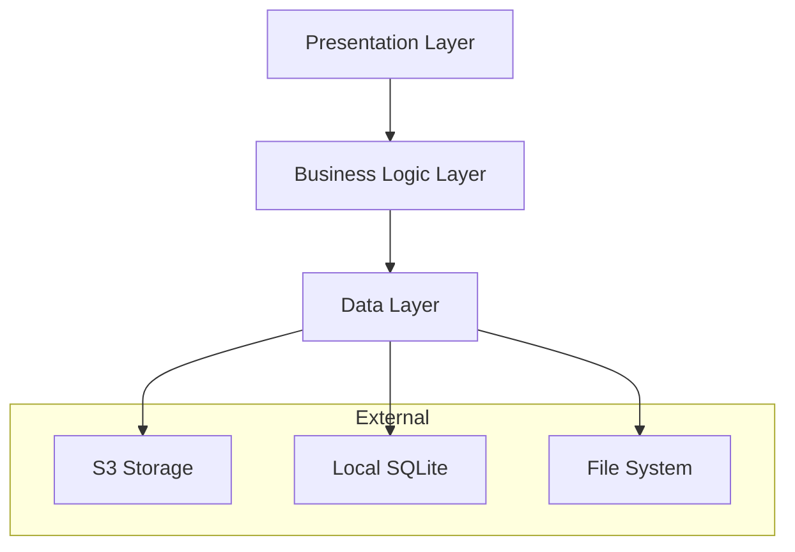

# Cherry Note 开发者指南

## 目录
1. [项目概述](#项目概述)
2. [开发环境设置](#开发环境设置)
3. [项目结构](#项目结构)
4. [架构设计](#架构设计)
5. [API参考](#api参考)
6. [开发工作流](#开发工作流)
7. [测试指南](#测试指南)
8. [构建和部署](#构建和部署)
9. [贡献指南](#贡献指南)

## 项目概述

Cherry Note 是一个跨平台的Markdown笔记应用，采用Flutter框架开发，支持Android、Windows和macOS平台。应用集成S3兼容的对象存储，提供实时编辑预览、多级目录管理和标签过滤功能。

### 技术栈
- **框架**: Flutter 3.16+
- **语言**: Dart 3.0+
- **状态管理**: BLoC Pattern
- **本地存储**: SQLite
- **云存储**: S3 Compatible APIs
- **依赖注入**: GetIt + Injectable
- **路由**: GoRouter

### 核心特性
- 跨平台支持 (Android, Windows, macOS)
- S3兼容对象存储集成
- 实时Markdown编辑和预览
- 多级文件夹结构
- 标签系统和过滤
- 离线支持和自动同步
- 导入导出功能

## 开发环境设置

### 系统要求
- Flutter SDK 3.16.0 或更高版本
- Dart SDK 3.0.0 或更高版本
- Android Studio / VS Code
- Git

### 平台特定要求

**Android开发:**
- Android SDK (API 21+)
- Java 17+

**Windows开发:**
- Visual Studio 2022 (C++ 工作负载)
- Windows 10 SDK

**macOS开发:**
- Xcode 14+
- macOS 10.14+

### 环境配置

1. **克隆项目**
```bash
git clone https://github.com/your-org/cherry-note.git
cd cherry-note
```

2. **安装依赖**
```bash
flutter pub get
```

3. **生成代码**
```bash
flutter packages pub run build_runner build --delete-conflicting-outputs
```

4. **运行应用**
```bash
# Android
flutter run -d android

# Windows
flutter run -d windows

# macOS
flutter run -d macos
```

## 项目结构

```
lib/
├── core/                     # 核心功能模块
│   ├── constants/           # 常量定义
│   ├── di/                  # 依赖注入配置
│   ├── error/               # 错误处理
│   ├── feedback/            # 用户反馈系统
│   ├── network/             # 网络相关
│   ├── performance/         # 性能优化
│   ├── router/              # 路由配置
│   ├── services/            # 核心服务
│   ├── theme/               # 主题配置
│   └── ui/                  # UI适配
├── features/                # 功能模块
│   ├── auth/                # 认证功能
│   ├── folders/             # 文件夹管理
│   ├── main/                # 主界面
│   ├── notes/               # 笔记功能
│   ├── settings/            # 设置功能
│   ├── sync/                # 同步功能
│   └── tags/                # 标签功能
├── shared/                  # 共享组件
│   ├── constants/           # 共享常量
│   ├── utils/               # 工具函数
│   └── widgets/             # 共享组件
└── main.dart               # 应用入口
```

### 功能模块结构
每个功能模块采用Clean Architecture分层：

```
feature/
├── data/                    # 数据层
│   ├── datasources/        # 数据源
│   ├── models/             # 数据模型
│   ├── repositories/       # 仓库实现
│   └── services/           # 数据服务
├── domain/                 # 领域层
│   ├── entities/           # 实体
│   ├── repositories/       # 仓库接口
│   ├── services/           # 领域服务
│   └── usecases/           # 用例
└── presentation/           # 表现层
    ├── bloc/               # 状态管理
    ├── pages/              # 页面
    └── widgets/            # 组件
```

## 架构设计

### 整体架构



### 核心组件

#### 1. 存储管理
```dart
// S3存储服务接口
abstract class S3StorageRepository {
  Future<void> uploadFile(String path, String content);
  Future<String> downloadFile(String path);
  Future<void> deleteFile(String path);
  Future<List<String>> listFiles(String prefix);
  Future<bool> fileExists(String path);
}

// 本地缓存服务
abstract class LocalCacheService {
  Future<void> cacheFile(String path, String content);
  Future<String?> getCachedFile(String path);
  Future<void> clearCache();
}
```

#### 2. 同步管理
```dart
// 同步服务接口
abstract class SyncService {
  Future<SyncResult> syncToRemote();
  Future<SyncResult> syncFromRemote();
  Future<void> enableAutoSync();
  Stream<SyncStatus> get syncStatusStream;
}

// 冲突解决服务
abstract class ConflictResolutionService {
  Future<List<FileConflict>> detectConflicts();
  Future<void> resolveConflict(String filePath, ConflictResolution resolution);
}
```

#### 3. 状态管理
使用BLoC模式管理应用状态：

```dart
// 笔记管理BLoC
class NotesBloc extends Bloc<NotesEvent, NotesState> {
  final NoteRepository _noteRepository;
  final SyncService _syncService;
  
  NotesBloc(this._noteRepository, this._syncService) : super(NotesInitial()) {
    on<LoadNotes>(_onLoadNotes);
    on<CreateNote>(_onCreateNote);
    on<UpdateNote>(_onUpdateNote);
    on<DeleteNote>(_onDeleteNote);
  }
  
  Future<void> _onLoadNotes(LoadNotes event, Emitter<NotesState> emit) async {
    // 实现加载笔记逻辑
  }
}
```

## API参考

### 核心服务API

#### S3StorageRepository
S3存储仓库接口，负责与S3兼容存储交互。

```dart
abstract class S3StorageRepository {
  /// 上传文件到S3存储
  /// [path] 文件路径
  /// [content] 文件内容
  /// 返回 Future<void>
  Future<void> uploadFile(String path, String content);
  
  /// 从S3存储下载文件
  /// [path] 文件路径
  /// 返回 Future<String> 文件内容
  Future<String> downloadFile(String path);
  
  /// 删除S3存储中的文件
  /// [path] 文件路径
  /// 返回 Future<void>
  Future<void> deleteFile(String path);
  
  /// 列出指定前缀的所有文件
  /// [prefix] 路径前缀
  /// 返回 Future<List<String>> 文件路径列表
  Future<List<String>> listFiles(String prefix);
  
  /// 检查文件是否存在
  /// [path] 文件路径
  /// 返回 Future<bool> 是否存在
  Future<bool> fileExists(String path);
  
  /// 批量上传文件
  /// [files] 文件路径和内容的映射
  /// 返回 Future<BatchOperationResult>
  Future<BatchOperationResult> uploadMultipleFiles(Map<String, String> files);
  
  /// 批量下载文件
  /// [paths] 文件路径列表
  /// 返回 Future<Map<String, String>> 路径和内容的映射
  Future<Map<String, String>> downloadMultipleFiles(List<String> paths);
}
```

#### SyncService
同步服务接口，管理本地和远程数据同步。

```dart
abstract class SyncService {
  /// 同步本地数据到远程
  /// 返回 Future<SyncResult> 同步结果
  Future<SyncResult> syncToRemote();
  
  /// 从远程同步数据到本地
  /// 返回 Future<SyncResult> 同步结果
  Future<SyncResult> syncFromRemote();
  
  /// 执行完整双向同步
  /// 返回 Future<SyncResult> 同步结果
  Future<SyncResult> fullSync();
  
  /// 启用自动同步
  /// [interval] 同步间隔
  /// 返回 Future<void>
  Future<void> enableAutoSync({Duration interval = const Duration(minutes: 5)});
  
  /// 禁用自动同步
  /// 返回 Future<void>
  Future<void> disableAutoSync();
  
  /// 同步状态流
  /// 返回 Stream<SyncStatus> 同步状态流
  Stream<SyncStatus> get syncStatusStream;
  
  /// 获取同步信息
  /// 返回 Future<SyncInfo> 同步信息
  Future<SyncInfo> getSyncInfo();
}
```

#### NoteRepository
笔记仓库接口，管理笔记的CRUD操作。

```dart
abstract class NoteRepository {
  /// 获取所有笔记
  /// 返回 Future<List<Note>> 笔记列表
  Future<List<Note>> getAllNotes();
  
  /// 根据ID获取笔记
  /// [id] 笔记ID
  /// 返回 Future<Note?> 笔记对象
  Future<Note?> getNoteById(String id);
  
  /// 根据文件夹ID获取笔记
  /// [folderId] 文件夹ID
  /// 返回 Future<List<Note>> 笔记列表
  Future<List<Note>> getNotesByFolderId(String folderId);
  
  /// 根据标签获取笔记
  /// [tags] 标签列表
  /// [logic] 逻辑关系 (AND/OR)
  /// 返回 Future<List<Note>> 笔记列表
  Future<List<Note>> getNotesByTags(List<String> tags, TagLogic logic);
  
  /// 搜索笔记
  /// [query] 搜索关键词
  /// 返回 Future<List<Note>> 笔记列表
  Future<List<Note>> searchNotes(String query);
  
  /// 创建笔记
  /// [note] 笔记对象
  /// 返回 Future<Note> 创建的笔记
  Future<Note> createNote(Note note);
  
  /// 更新笔记
  /// [note] 笔记对象
  /// 返回 Future<Note> 更新的笔记
  Future<Note> updateNote(Note note);
  
  /// 删除笔记
  /// [id] 笔记ID
  /// 返回 Future<void>
  Future<void> deleteNote(String id);
}
```

### 数据模型

#### Note
笔记实体模型。

```dart
class Note extends Equatable {
  final String id;
  final String title;
  final String content;
  final String folderId;
  final List<String> tags;
  final DateTime createdAt;
  final DateTime updatedAt;
  final bool isSticky;
  
  const Note({
    required this.id,
    required this.title,
    required this.content,
    required this.folderId,
    required this.tags,
    required this.createdAt,
    required this.updatedAt,
    this.isSticky = false,
  });
  
  /// 从Markdown文件创建笔记
  factory Note.fromMarkdown(String filePath, String markdown);
  
  /// 转换为Markdown格式
  String toMarkdown();
  
  /// 复制并修改属性
  Note copyWith({
    String? id,
    String? title,
    String? content,
    String? folderId,
    List<String>? tags,
    DateTime? createdAt,
    DateTime? updatedAt,
    bool? isSticky,
  });
  
  @override
  List<Object?> get props => [id, title, content, folderId, tags, createdAt, updatedAt, isSticky];
}
```

#### FolderNode
文件夹节点模型。

```dart
class FolderNode extends Equatable {
  final String id;
  final String name;
  final String? parentId;
  final DateTime createdAt;
  final DateTime updatedAt;
  final String? description;
  final String? color;
  final List<FolderNode> children;
  final List<Note> notes;
  
  const FolderNode({
    required this.id,
    required this.name,
    this.parentId,
    required this.createdAt,
    required this.updatedAt,
    this.description,
    this.color,
    this.children = const [],
    this.notes = const [],
  });
  
  /// 从文件夹元数据创建
  factory FolderNode.fromMetadata(String folderPath, String? metadata);
  
  /// 转换为元数据JSON
  String toMetadataJson();
  
  /// 获取文件夹路径
  String get path;
  
  /// 获取所有子文件夹
  List<FolderNode> get allChildren;
  
  /// 获取所有笔记（包括子文件夹）
  List<Note> get allNotes;
  
  @override
  List<Object?> get props => [id, name, parentId, createdAt, updatedAt, description, color];
}
```

## 开发工作流

### Git工作流
项目采用Git Flow工作流：

- `main`: 主分支，包含稳定的发布版本
- `develop`: 开发分支，包含最新的开发功能
- `feature/*`: 功能分支，用于开发新功能
- `hotfix/*`: 热修复分支，用于紧急修复
- `release/*`: 发布分支，用于准备发布版本

### 开发流程

1. **创建功能分支**
```bash
git checkout develop
git pull origin develop
git checkout -b feature/new-feature-name
```

2. **开发和测试**
```bash
# 编写代码
# 运行测试
flutter test

# 代码生成
flutter packages pub run build_runner build --delete-conflicting-outputs

# 代码分析
flutter analyze
```

3. **提交代码**
```bash
git add .
git commit -m "feat: add new feature description"
git push origin feature/new-feature-name
```

4. **创建Pull Request**
- 在GitHub上创建PR到develop分支
- 填写PR模板，描述更改内容
- 等待代码审查和CI检查

### 代码规范

#### Dart代码风格
遵循[Dart Style Guide](https://dart.dev/guides/language/effective-dart/style)：

```dart
// 好的命名
class NoteRepository {}
void createNote() {}
final String noteTitle = '';

// 好的格式化
if (condition) {
  doSomething();
} else {
  doSomethingElse();
}

// 好的文档注释
/// 创建新笔记
/// 
/// [title] 笔记标题
/// [content] 笔记内容
/// 返回创建的笔记对象
Future<Note> createNote(String title, String content) async {
  // 实现逻辑
}
```

#### 提交信息规范
使用[Conventional Commits](https://www.conventionalcommits.org/)格式：

```
<type>[optional scope]: <description>

[optional body]

[optional footer(s)]
```

类型说明：
- `feat`: 新功能
- `fix`: 修复bug
- `docs`: 文档更新
- `style`: 代码格式化
- `refactor`: 代码重构
- `test`: 测试相关
- `chore`: 构建过程或辅助工具的变动

## 测试指南

### 测试策略
项目采用测试金字塔策略：

- **单元测试 (70%)**: 测试业务逻辑和工具函数
- **集成测试 (20%)**: 测试组件间交互
- **端到端测试 (10%)**: 测试完整用户流程

### 运行测试

```bash
# 运行所有测试
flutter test

# 运行特定测试文件
flutter test test/features/notes/domain/usecases/create_note_test.dart

# 运行测试并生成覆盖率报告
flutter test --coverage

# 查看覆盖率报告
genhtml coverage/lcov.info -o coverage/html
open coverage/html/index.html
```

### 编写测试

#### 单元测试示例
```dart
import 'package:flutter_test/flutter_test.dart';
import 'package:mockito/mockito.dart';
import 'package:cherry_note/features/notes/domain/usecases/create_note.dart';

void main() {
  group('CreateNote', () {
    late CreateNote usecase;
    late MockNoteRepository mockRepository;
    
    setUp(() {
      mockRepository = MockNoteRepository();
      usecase = CreateNote(mockRepository);
    });
    
    test('should create note successfully', () async {
      // arrange
      final note = Note(
        id: '1',
        title: 'Test Note',
        content: 'Test content',
        folderId: 'folder1',
        tags: ['test'],
        createdAt: DateTime.now(),
        updatedAt: DateTime.now(),
      );
      
      when(mockRepository.createNote(any))
          .thenAnswer((_) async => note);
      
      // act
      final result = await usecase(CreateNoteParams(
        title: 'Test Note',
        content: 'Test content',
        folderId: 'folder1',
        tags: ['test'],
      ));
      
      // assert
      expect(result.isRight(), true);
      result.fold(
        (failure) => fail('Should not fail'),
        (createdNote) => expect(createdNote, equals(note)),
      );
      
      verify(mockRepository.createNote(any)).called(1);
    });
  });
}
```

#### Widget测试示例
```dart
import 'package:flutter/material.dart';
import 'package:flutter_test/flutter_test.dart';
import 'package:flutter_bloc/flutter_bloc.dart';
import 'package:cherry_note/features/notes/presentation/widgets/note_list_widget.dart';

void main() {
  group('NoteListWidget', () {
    testWidgets('should display notes when loaded', (tester) async {
      // arrange
      final notes = [
        Note(id: '1', title: 'Note 1', content: 'Content 1', /* ... */),
        Note(id: '2', title: 'Note 2', content: 'Content 2', /* ... */),
      ];
      
      // act
      await tester.pumpWidget(
        MaterialApp(
          home: BlocProvider<NotesBloc>(
            create: (_) => MockNotesBloc()..add(LoadNotes()),
            child: NoteListWidget(),
          ),
        ),
      );
      
      await tester.pump();
      
      // assert
      expect(find.text('Note 1'), findsOneWidget);
      expect(find.text('Note 2'), findsOneWidget);
    });
  });
}
```

## 构建和部署

### 本地构建

```bash
# Android
./scripts/build_android.sh production release

# Windows
./scripts/build_windows.sh release

# macOS
./scripts/build_macos.sh release

# 所有平台
./scripts/build_all.sh release
```

### CI/CD流程
项目使用GitHub Actions进行自动化构建和部署：

1. **代码提交触发**
2. **运行测试和代码分析**
3. **多平台并行构建**
4. **生成构建产物**
5. **创建GitHub Release**

### 发布流程

1. **准备发布**
```bash
# 更新版本号
# 更新CHANGELOG.md
# 创建发布分支
git checkout -b release/v1.0.0
```

2. **测试和验证**
```bash
# 运行完整测试套件
flutter test

# 构建所有平台
./scripts/build_all.sh release

# 手动测试关键功能
```

3. **创建发布标签**
```bash
git tag -a v1.0.0 -m "Release version 1.0.0"
git push origin v1.0.0
```

4. **发布到各平台**
- Android: 上传到Google Play Store
- Windows: 发布到Microsoft Store或直接分发
- macOS: 发布到Mac App Store或直接分发

## 贡献指南

### 如何贡献

1. **Fork项目**
2. **创建功能分支**
3. **编写代码和测试**
4. **提交Pull Request**
5. **参与代码审查**

### 贡献类型
- 🐛 Bug修复
- ✨ 新功能开发
- 📚 文档改进
- 🎨 UI/UX改进
- ⚡ 性能优化
- 🧪 测试覆盖
- 🔧 工具和配置

### 代码审查清单
- [ ] 代码符合项目规范
- [ ] 包含适当的测试
- [ ] 文档已更新
- [ ] 无破坏性更改
- [ ] 性能影响可接受
- [ ] 安全性考虑

### 获取帮助
- 📧 邮件: dev@cherrynote.app
- 💬 讨论: GitHub Discussions
- 🐛 问题: GitHub Issues
- 📖 文档: 项目Wiki

---

感谢您对Cherry Note项目的贡献！